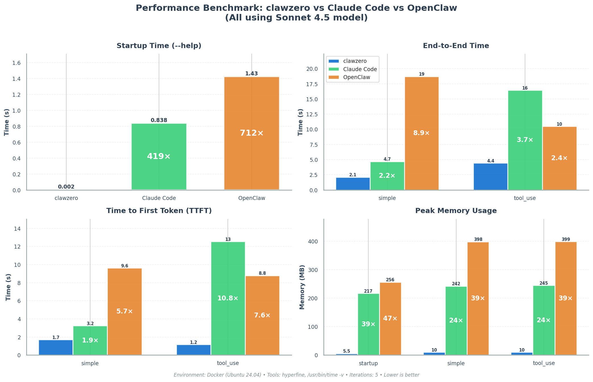

<p align="center">
  
</p>

# clawzero

Ultra-fast, stable AI agent CLI built in Rust. Inspired by [OpenClaw](https://github.com/openclaw/openclaw).

**[Documentation](https://betta-lab.github.io/clawzero/)**

## Features

- **Inline TUI** — Claude Code-style inline terminal UI
- **Streaming-first** — Real-time SSE streaming responses
- **Multi-provider** — Anthropic / OpenAI / OpenRouter / Ollama / Vertex AI / Bedrock
- **Agent loop** — Think → ToolCall → Observe autonomous execution
- **Built-in tools** — bash, file read/write/edit, memory read/write
- **Session persistence** — JSONL-based conversation history with resume
- **Memory system** — Persistent MEMORY.md (global + project-local)
- **Plugin tools** — Custom bash/HTTP tools via TOML config
- **Gateway** — Slack / Discord / Web UI bot via `clawzero gateway`

## Benchmark

<p align="center">
  
</p>

### Summary Table

| Scenario | Metric | clawzero | Claude Code | OpenClaw |
|---|---|---:|---:|---:|
| **startup** | E2E Time | **2.16 ms** | 838 ms (388x) | 1,425 ms (659x) |
| | Memory | **5.5 MB** | 217 MB (39x) | 256 MB (47x) |
| **simple** | E2E Time | **2,100 ms** | 4,674 ms (2.2x) | 18,718 ms (8.9x) |
| | TTFT | **1,689 ms** | 3,232 ms (1.9x) | 9,611 ms (5.7x) |
| | Memory | **10.1 MB** | 242 MB (24x) | 398 MB (39x) |
| **tool_use** | E2E Time | **4,423 ms** | 16,435 ms (3.7x) | 10,482 ms (2.4x) |
| | TTFT | **1,162 ms** | 12,529 ms (10.8x) | 8,774 ms (7.6x) |
| | Memory | **10.2 MB** | 245 MB (24x) | 399 MB (39x) |

> **Environment**: Docker (Ubuntu 24.04), all tools using `anthropic/claude-sonnet-4-5-20250929`
> **Tools**: `hyperfine` (E2E time), `/usr/bin/time -v` (memory), custom wrapper (TTFT)
> **Reproduce**: `docker compose -f bench/docker-compose.yml run bench`

## Quick Start

```bash
curl -fsSL https://raw.githubusercontent.com/betta-lab/clawzero/main/install.sh | sh
clawzero init          # Interactive setup — generates config with API keys
clawzero "Hello, world!"
```

Or build from source:

```bash
cargo install --path .
```

See the [documentation](https://betta-lab.github.io/clawzero/) for installation options, configuration, and usage details.

## Contributing

See [CONTRIBUTING.md](CONTRIBUTING.md) for development setup, coding conventions, and PR guidelines.

## License

TBD
