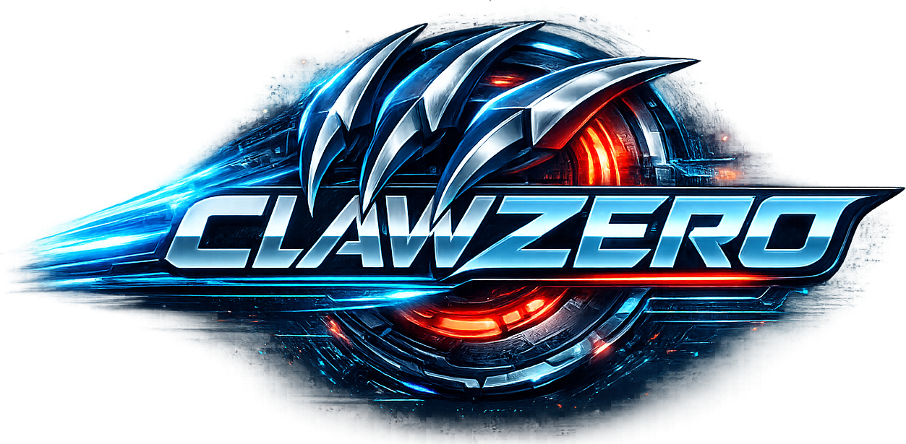

<p align="center">
  
</p>

# clawzero

Ultra-fast, stable AI agent CLI built in Rust. Inspired by [OpenClaw](https://github.com/openclaw/openclaw).

## Features

- **Inline TUI** — Claude Code-style inline terminal UI that grows in-place (no full-screen takeover)
- **Streaming-first** — Real-time responses via SSE streaming
- **Multi-provider** — Switch between Anthropic / OpenAI / OpenRouter / Ollama and more via config alone
- **Extensible provider design** — Two protocol implementations cover all major providers; adding a new provider requires zero code changes
- **Agent loop** — Autonomous task execution via Think → ToolCall → Observe cycle
- **Built-in tools** — bash execution, file read/write/edit, memory read/write (6 tools)
- **Session persistence** — JSONL-based conversation history with resume support
- **Context window management** — Automatic token estimation and message compaction when nearing context limits
- **Memory system** — Persistent MEMORY.md files (global + project-local) injected into system prompt
- **Plugin tools** — Define custom bash/HTTP tools via TOML config
- **Cloud auth** — Vertex AI (OAuth2 via gcloud) and AWS Bedrock (SigV4) authentication
- **Gateway** — Run as Slack / Discord bot or Web UI with `clawzero gateway`
- **Web UI** — Browser-based chat interface via `clawzero gateway webui`

## Quick Start

```bash
cargo install --path .
export ANTHROPIC_API_KEY="sk-ant-..."
clawzero "Hello, world!"
```

See [Installation](getting-started/installation.md) and [Quick Start](getting-started/quickstart.md) for details.
